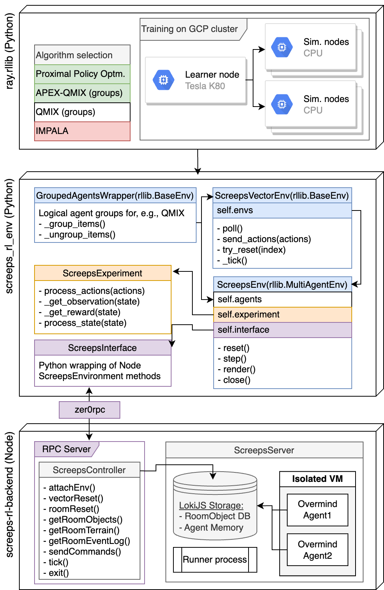

# Overmind-RL
Reinforcement learning for [Overmind](https://github.com/bencbartlett/Overmind), an autonomous Screeps AI.

## Paper

This was a final project for [Stanford's reinforcement learning course](https://web.stanford.edu/class/msande338/). You can read the paper for this project [here](./screeps_reinforcement_learning.pdf).

## Background

Screeps is a multiplayer real-time strategy (RTS) game for programmers. The core game objective is to expand your colony, gathering resources and fighting other players along the way. To manipulate your units, you write a script to control their behavior in JavaScript; everything from moving, harvesting, building, fighting, and trading is entirely driven by your code, which is executed on a single server that runs 24/7, populated by every other player and their armies of creeps.

Screeps has nearly limitless depth to it, with a variably-sized action space which, even for moderate numbers of agents, can be far larger than that of many popular single-agent games such as chess. It shares many similar mechanics with other well-studied multi-agent games, such as StarCraft, providing a convenient body of literature on which to base initial experiments. Because Screeps is a complex environment which can be interacted with entirely programmatically, it provides an ideal platform for studying multi-agent reinforcement learning concepts.

As in many RTS games, combat in Screeps is highly nuanced, with certain configurations of posi- tions being favorable over others, allowing for coordinated movement strategies with complexity beyond what could feasibly be hand-coded. For this project, I implemented a training environment which allows a Python-based reinforcement learning agent to interact with many remote, vectorized instances of the Screeps backend, with the ultimate goal of being able to discover effective combat strategies. The training environment allowed for scalability and distribution of processing to obtain step throughputs which would otherwise be impossible running with a single, non-vectorized server. I performed two sets of experiments using the training environment I developed and was able to demonstrate desirable movement behavior and effective but preliminary combat behavior.

## Structure

The training environment I implemented for this project has three main components, encapsulated as separate packages: in increasing order of abstraction, screeps-rl-backend, a node.js package which exposes methods via remote procedure call (RPC) to controllably initialize, reset, and step the Screeps server and communicate with the underlying agents; screeps_rl_env which provides standardized gym- and rllib-style Python training environments for agents to interact with; and models, which leverages customized implementations of various RL algorithms within rllib to train within the environment and provides scripts for automatically deploying training to a dynamically scalable Google compute cluster. A UML diagram of the full training environment is shown below.




## Setup

Note that I am releasing this project four years after I finished working on it. Everything here is very WIP and I can't guarantee that any of this will work with a modern version of the game with 4 years of additional development since I made this.

Download `screeps-launcher` from https://github.com/screepers/screeps-launcher

Create a config file and run `./screeps-launcher`. If you receive a Python error of `dictionary changed size during iteraion`, see https://github.com/laverdet/isolated-vm/issues/158. The issue is that screeps uses an old version of isolated-vm and must be installed with Python 2.7. Create an environment `conda create —name py2 python=2.7` and `conda activate py2` then reinstall.

If you receive an error along the lines of:

```
2020/03/24 12:50:59 [processor_4] exec: screeps-engine-processor
2020/03/24 12:51:00 [processor_0] Exited with error: exit status 1
2020/03/24 12:51:00 [processor_2] Exited with error: exit status 1
```